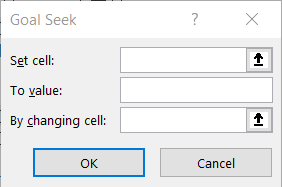
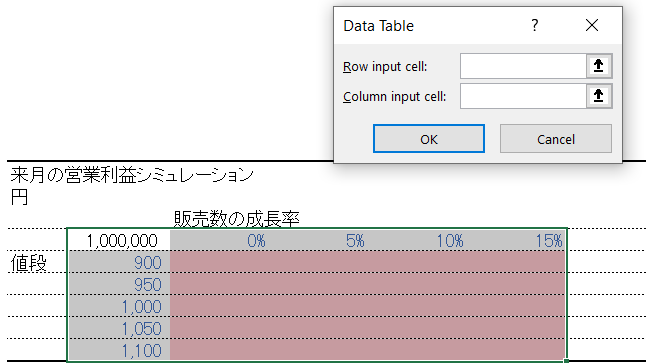
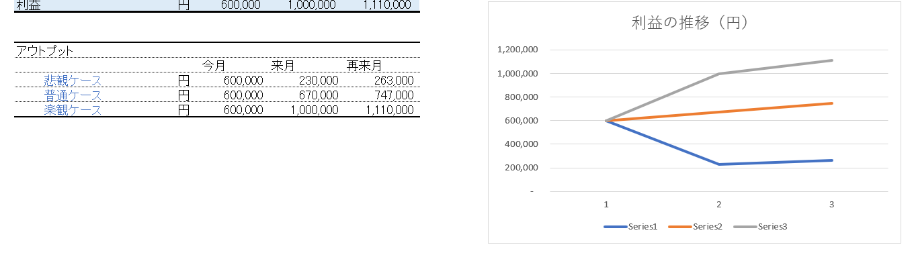

# 191008 授業日記

## フィッシュボーンモデル

利益の構成を可視化する考え方。

***
## ケーススタディ
### **バーガーショップ**

>今月販売数　1,000,000個

>販売数成長率 10%

>単価　1,000円

>1個あたりコスト　300円

>賃借料　100,000円

***

**フィッシュボーンモデル**

- 売上
  - 販売数＊単価
  - （来月からの販売数）販売数＊(1+成長率)
- 費用
  - 賃借料
  - 1個あたりコスト＊販売数
- 利益　（売上ー費用）

## Note to myself

- practice to understand overview
- be able to break down the process logically
- learn more about Excel 

# 191009 授業日記

## Thing we covered today
- 損益分岐点計算方法
- 感応度分析
- シナリオ分析

### 損益分岐点
***
- (common data already exists)
- For  variable *x*  to reach value *a*, what variable *y* should be? 
- use What if analysis -> Goal Seeker 

|Goal Seeker|Variable|
|-----------|:---|
|Set Cell| Variable *x*|
|To Value| Value *a*|
|By Changing cell| Variable *y*|

### 感応度分析
Sensitivity Analysis 
***
- (common data already exists)
- if there are changes in  two variables , what is going to happen to value *a*?

- select appropriate values from common dataset.
- apply coloring for visibility 

### シナリオ分析
***
- (common data already exists)
- Create 3 scienarios based on value driver(s)
- use choose variables for flexibility
- connect with common data set to calculate profit based on each scienario
- copy each values into table and make it to graph

